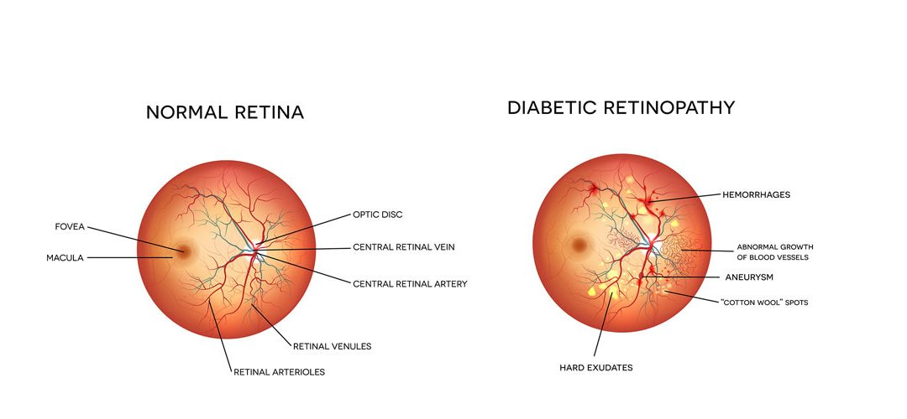
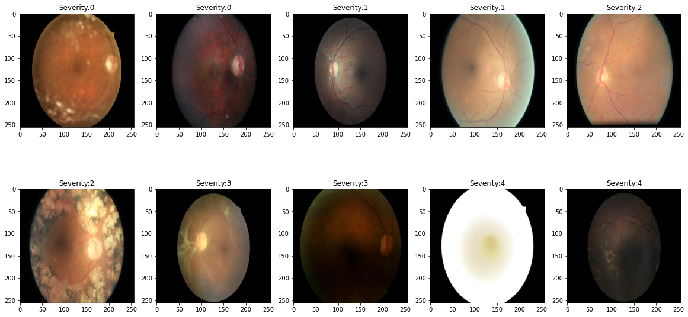
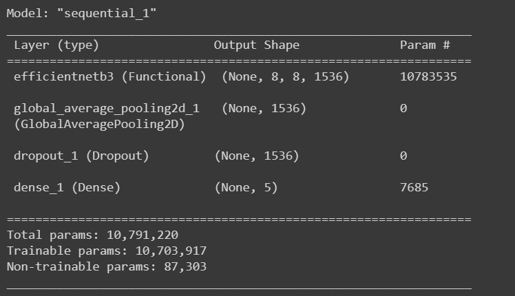
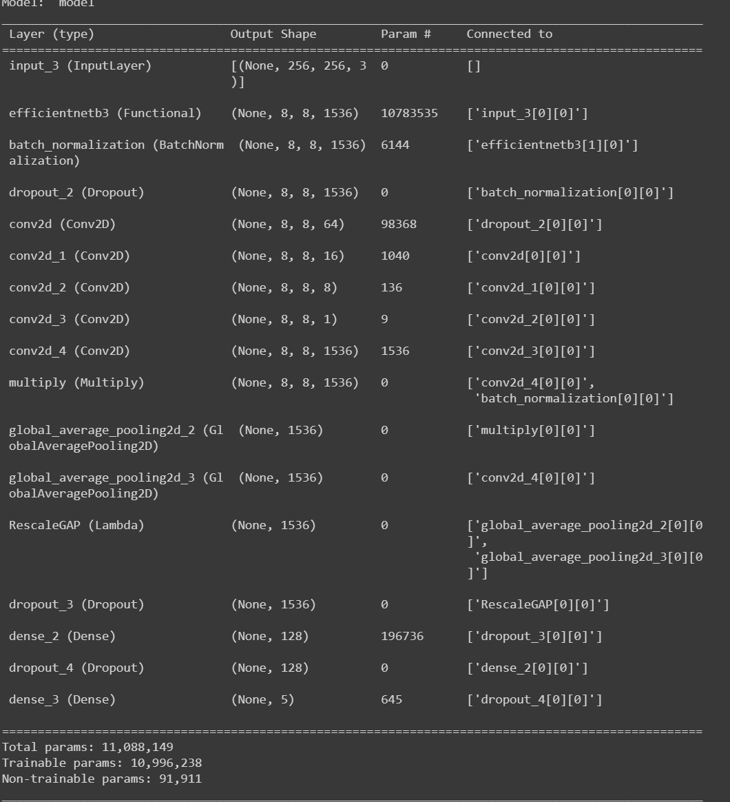

# diabetic-retinopathy /w Efficientnet

# Overview
<ul>
  <li>What is Diabetic Retinopathy?</li>
  A complication of diabetes that affects the eyes. Diabetic retinopathy is caused by damage to the blood vessels in the tissue at the back of the eye (retina). Poorly controlled blood sugar is a risk factor. Early symptoms include floaters, blurriness, dark areas of vision, and difficulty perceiving colors. Blindness can occur.

  <li>Goal of this Project?</li>
  <ul>
    <li>Here I have used Kaggle dataset of high-resolution images of the human eye retina with the annotated severity levels.</li>
    <li>For classification of severity of DR I used vanilla Efficient model (EfficientnetB3) model on resized 947 sample images of size (256,256,3).</li>
    <li>Post that I augmented the model with attention layers to focus on specific areas on learning features from that region.</li>
   </ul>
   <li>Credits</li>
   <ul>
      <li><a href = "https://www.kaggle.com/c/diabetic-retinopathy-detection/overview"> Dataset</a></li>
      <li><a href = "https://keras.io/examples/vision/image_classification_efficientnet_fine_tuning/"> Keras Efficientnet</a></li>
      <li><a href = "https://www.kaggle.com/kmader/inceptionv3-for-retinopathy-gpu-hr#Attention-Model"> Attention model</a></li>
   </ul>
</ul>

# Samples

# Model Summary
 
Vanilla Efficientnet Model
 

 
Attention Model
 

